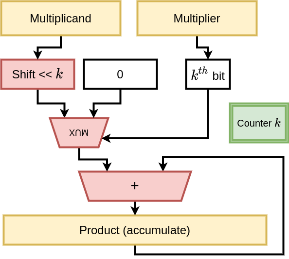

# Assignment 1: Synthesis

This assignment is an extension of the original a1, with the addition of synthesis using yosys.

## Goals

- To be able to produce a synthesizable design of your sequential multiplier
- Understand how your code translates into a synthesized design

## Given

- Test bench for sequential divider
- Template code that you can use to fill in
- Some test cases

## Details on the assignment

Most of the things are the same as the original a1. You will notice that in the file "program_file_synth.txt", the last file that is included is a file present in the yosys installation location. In particular, it comes under the `xilinx` folder. This is because the synth.ys (a script for yosys) generates a verilog output after synthesis and this will require additional modules/primitives, which define the actual hardware on the board. Here we use the `xilinx` primitives, and hence we need to specify the appropriate location of the file that includes the definition of these primitives. Note that here we only include one additional file, which should be sufficient for the purposes of a sequential multiplier, atleast the one that you have written. For the more curious ones, you may check out the entire folder and see the other primitives that are available as well. 

<!-- ### Multiplication

This basically refers to the "long form" multiplication as we learn in school.  For each digit of the multiplier, we shift the multiplicand to the appropriate place value, and then add all the partial products.  An example of the partial products in binary for a simple 4-bit multiplication are shown below.  As expected, multiplying two 4-bit numbers can result in an output that is up to 8 bits in length.  

```
        0110    # Decimal 6 - Multiplicand
      x 0011    # Decimal 3 - Multiplier
    --------
        0110    # Partial product 0 (PP0)
       0110     # PP1
      0000      # PP2 
     0000       # PP3
    --------
    00010010    # Decimal 18
    --------
```

### Number representation

The numbers themselves are represented in 2's complement notation.  Therefore, if the multiplicand is negative, the PP values should be "sign-extended" to get the correct result.  An example for negative multiplicand is shown below - negative multiplier requires similar careful handling, and is left as an exercise.

```
        1010    # Decimal -6
      x 0011    # Decimal 3
    --------
    11111010    # Partial product 0 (PP0) - sign extended
    1111010     # PP1
    000000      # PP2 
    00000       # PP3
    --------
 (1)11101110    # Decimal -18 (discard the overflow 1)
    --------
```

### Hardware implementation

The above multiplication process can be directly implemented as combinational logic, where each partial product vector is created using a set of AND gates, and the results are put through a chain of adders.

The other alternative is to have a reduced hardware with a single register to hold the final product.  This **accumulates** the final product by iterating over several clock cycles (how many?).  A diagram indicating the architecture is shown here.

 -->


## HowTo

Fork this repository (`EE2003-2021/a1_synthesis`) into your namespace so that you can edit and push changes.

You are given a test bench (`seq_mult_tb.v`) with suitable test cases (`test_in.dat`).  The assignment repository also contains a `run.sh` script that will compile the code and run the tests that will be performed on the drone server. This same script also uses yosys to create a synthesized verilog output, which is again run through these tests to check for functional correctness. For now, the drone server will only check if your code compiles correctly, so you **must** use run.sh to confirm whether your code works before submitting it.

**IMPORTANT**: the filename for the code that you write must be `seq_mult.v` - otherwise the auto-grader will not recognize it.

Once you have confirmed that your code passes all the tests, commit all the changes, tag it for submission, and push to your repository.

### Submitting

Follow the instructions from assignment 0 to tag and push and check the results on drone.  Submit the drone link on Moodle.

## Date

Due Midnight, Sept 8, 2021
